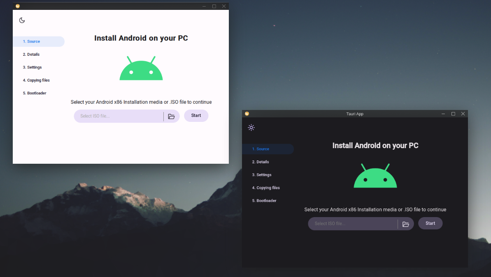

# Android-x86 Installer
Cross-platform Android x86 installer desktop app built with Tauri.  
You can see a preview of the user interface right now on your browser: https://xtr126.github.io/Android-x86-installer   
The installer can function without root access. For safety, it was designed not to mess with the bootloader.  
It re-uses the grub config and kernel command line parameters from the ISO.  

Download .deb or .AppImage for Linux: https://github.com/Xtr126/Android-x86-installer/releases  
On the Arch Linux User repository (AUR): https://aur.archlinux.org/packages/android-x86-installer-tauri-bin   
Windows Support is planned.

## Development
- [Tauri Prerequisites](https://tauri.app/v1/guides/getting-started/prerequisites/)
- It might take a while to compile the rust dependencies.
```
git clone https://github.com/Xtr126/Android-x86-installer.git 
cd Android-x86-installer
pnpm install 
pnpm tauri dev
```
  

The installer also supports generating a script to boot the same physical Android install in qemu: 
